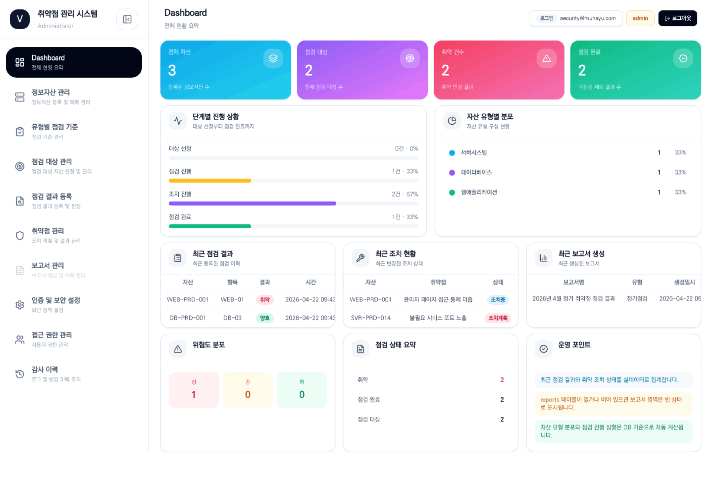

# 취약점 관리시스템 개발 완료 및 오픈 안내

안녕하세요.

정보자산 점검과 취약점 조치 현황을 한 곳에서 관리할 수 있는 **취약점 관리시스템** 개발이 완료되어 안내드립니다.

이번 시스템은 기존에 엑셀과 개별 파일로 분산 관리하던 취약점 관리 업무를 하나의 흐름으로 정리하기 위해 구축되었습니다. 정보자산 등록부터 점검 기준 관리, 점검 대상 확정, 점검 결과 등록, 취약점 조치 관리, 보고서 생성까지 단계별로 진행할 수 있습니다.

아래 GIF는 실제 시스템 화면 기준으로 대시보드, 정보자산 관리, 유형별 점검 기준, 점검 대상 관리, 점검 결과 등록, 취약점 관리, 보고서 관리 흐름을 요약한 안내 이미지입니다.

## 주요 기능

- **정보자산 관리**: 서버, 네트워크, DB, 웹 등 점검 대상 자산 등록 및 엑셀 Import/Export
- **유형별 점검 기준 관리**: 자산 유형별 보안 점검 항목 등록 및 관리
- **점검 대상 관리**: 등록된 자산 중 실제 점검 대상을 선정하고 확정
- **점검 결과 등록**: 점검 결과 및 스크립트 실행 결과 Import
- **취약점 조치 관리**: 취약점 상태, 조치 예정일, 담당자, 조치 내용을 관리
- **보고서 생성**: 점검 결과와 취약점 현황 기반 결과 보고서 생성
- **인증 및 권한 관리**: Google OAuth 로그인, 사용자 권한, 감사 이력 관리

## 이용 대상

- 정보보호 및 보안 점검 담당자
- 시스템, 인프라, 서비스 운영 담당자
- 취약점 조치 담당 부서 및 담당자
- 점검 결과 및 조치 현황 확인이 필요한 관리자

## 사용 흐름

1. Google 계정으로 로그인합니다.
2. 정보자산을 등록하거나 엑셀 파일로 업로드합니다.
3. 자산 유형별 점검 기준을 등록합니다.
4. 점검 대상을 선정한 뒤 확정합니다.
5. 점검 결과를 입력하거나 스크립트 결과를 Import합니다.
6. 취약점 조치 상태를 관리합니다.
7. 보고서 메뉴에서 결과 보고서를 생성합니다.

각 단계는 이전 단계가 확정되어야 다음 단계로 진행할 수 있도록 구성되어 있어, 점검 데이터의 누락과 순서 오류를 줄일 수 있습니다.

## 접속 및 로그인

- 접속 URL: 담당 부서에서 별도 공지
- 로그인 방식: Google OAuth
- 로그인 가능 계정: 허용된 회사 계정 또는 승인된 계정

접속 또는 로그인에 문제가 있는 경우, 사용 계정과 오류 화면을 함께 첨부하여 관리자에게 문의해 주세요.

## 안내 사항

- 최초 사용 전 등록 대상 자산과 점검 기준 파일을 준비해 주세요.
- 운영 데이터의 정합성을 위해 단계별 확정은 담당자 확인 후 진행해 주세요.
- 확정 이후 수정이 필요한 경우 관리자 또는 담당 부서에 문의해 주세요.

감사합니다.
